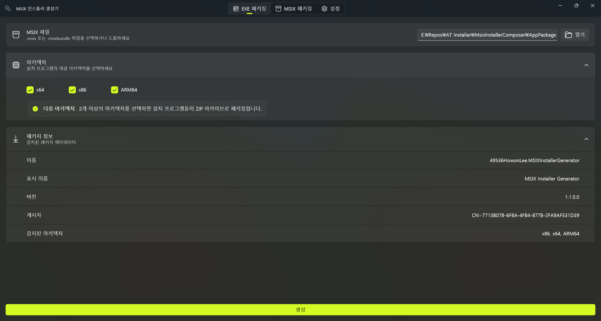

# MSIX Installer Generator

한국어 | **[English](MSIX.md)**

[](https://www.nuget.org/packages/aticmsixgen)
[](https://github.com/airtaxi/AT-Installer/actions/workflows/pack-and-publish.yml)

모든 애플리케이션으로부터 Windows 샌드박싱이 적용된 인스톨러를 생성하는 올인원 솔루션<br><br>


## 왜 MSIX인가?

MSIX는 개발자와 최종 사용자 모두에게 실질적인 이점을 제공하는 현대적인 Windows 패키징 포맷입니다.

- **기본적으로 샌드박싱** — Windows가 프로그램이 생성하는 레지스트리 키, 파일 연결, 기타 시스템 변경 사항을 격리된 환경에서 자동으로 관리합니다.
- **깨끗한 제거** — 사용자가 애플리케이션을 제거하면 아무것도 남지 않습니다. 찌꺼기 레지스트리 항목도, 남은 AppData 폴더도 없습니다.
- **하나의 패키지로 다중 아키텍처** — MSIXBundle 포맷을 사용하면 x64, x86, ARM64 빌드를 단일 `.msixbundle` 파일로 제공할 수 있습니다. 사용자는 한 번만 다운로드하면 Windows가 알아서 적절한 아키텍처를 설치합니다.

하지만 MSIX 자체는 배포하기 어렵습니다. 최종 사용자는 개발자 모드를 켜고, PowerShell 명령어를 실행하고, 인증서를 신뢰하고, 복잡한 종속성 오류를 해결해야 설치할 수 있습니다.

**AT Installer와 MSIX Installer Generator가 이 모든 불편함을 없앱니다.** MSIX의 샌드박싱, 깔끔한 제거, 다중 아키텍처 패키징을 그대로 제공하면서도, 기존의 더블클릭 EXE 인스톨러처럼 간편하게 배포할 수 있습니다. 사용자는 다운로드 후 실행하기만 하면 됩니다.

## 시작하기

### Microsoft Store에서 다운로드

[](https://apps.microsoft.com/detail/9P5GS17TCDQX)

### 필수 요구 사항

- Windows 10 (1809) 이상

---

## MSIX 패키징

Electron, Tauri, WPF 등 애플리케이션 프레임워크에서 네이티브 MSIX 패키징을 제공하지 않을 때, MSIX Installer Generator가 이를 간편하게 처리합니다. [WinApp CLI](https://github.com/microsoft/WinAppCli)를 기반으로 동작하여 MSIX 패키징을 직접 다룰 필요가 없습니다.

> 이미 패키징된 MSIX 애플리케이션이 있다면 [EXE 패키징](#exe-패키징) 섹션으로 바로 이동하세요.

MSIX 패키징은 **인증서**, **매니페스트**, **패키징** 세 단계로 이루어집니다.

### 인증서

인증서는 배포에 있어 필수는 아니지만 **적극 권장**합니다. MSIX는 사이드로딩 전에 인증서를 신뢰해야 하므로, 매 배포마다 임시 인증서로 서명하면 사용자가 매 버전 업데이트마다 새로운 인증서를 시스템에 추가해야 하는 문제가 발생합니다.

이를 방지하기 위해 전용 인증서를 한 번 생성하고 여러 릴리스에 재사용하세요.

인증서 생성에 필요한 세 가지 입력값:

- **게시자 (Publisher)** — X.500 고유 이름 필드입니다. X.500에 익숙하지 않다면 게시자 이름만 입력하면 자동으로 X.500의 Common Name(CN)으로 매핑됩니다. 애플리케이션을 배포하는 주체의 이름을 입력하세요.
- **유효기간 (일수)** — 유효기간이 지나면 이 인증서로 더 이상 새로운 서명을 할 수 없습니다. 다만, 인증서가 유효한 동안 서명한 것은 유효기간이 지나도 인증이 유효하므로, 보안상 적절한 기간을 기입하면 됩니다. 기본값은 **5년(1825일)**입니다.
- **비밀번호** — 기본값은 `password`입니다. 이 비밀번호는 MSIX 패키지 생성 시 필요하며, 패키징 메뉴에서 기본 비밀번호인 `password`가 자동 입력됩니다. 보안을 더 강화하고 싶다면 적절한 강도의 비밀번호를 설정하는 것도 좋습니다.

### 매니페스트

매니페스트(`.aticmsixconfig`)는 **버전과 인증서 정보를 제외한** MSIX 생성에 필요한 모든 정보를 하나의 설정 파일로 통합합니다. 패키징 전에 매니페스트를 작성하여 배포할 프로그램의 기본 정보를 설정할 수 있습니다.

| 필드 | 설명 |
|---|---|
| **표시 이름 (Display Name)** | 사용자에게 표시되는 애플리케이션 이름입니다. |
| **설명 (Description)** | 애플리케이션에 대한 설명입니다. |
| **실행 파일 (Executable)** | 빌드 출력 내의 실행 파일 이름입니다 (예: `MyApp.exe`). 각 폴더의 아키텍처를 자동으로 감지하는 데 사용됩니다. |
| **로고 (Logo)** | (선택사항) 로고 이미지 경로 (`.png`, `.jpg`, `.bmp`, `.ico`). 매니페스트에 직접 포함됩니다. |

### 패키징

매니페스트, 인증서, 버전, 하나 이상의 빌드 출력 디렉토리가 준비되면 패키징할 수 있습니다.

MSIX는 **MSIXBundle** 포맷을 지원하여 여러 아키텍처를 하나의 패키지로 관리할 수 있으므로, 아키텍처별로 각각의 출력 폴더를 추가할 수 있습니다 (예: x64용 한 폴더, ARM64용 한 폴더). 도구가 각 폴더의 아키텍처를 실행 파일에서 자동으로 감지하여, 단일 `.msix`(아키텍처 1개) 또는 `.msixbundle`(아키텍처 여러 개)을 생성합니다.

---

## EXE 패키징

> EXE 패키징 메뉴는 사전에 패키징된 MSIX 또는 MSIX Installer Generator로 생성된 MSIX를 독립 실행형 인스톨러 EXE로 변환합니다.

MSIX만으로는 최종 사용자에게 배포하기에 적절한 포맷이 아닙니다. [README](README.ko.md)에 설명된 것처럼 MSIX를 사이드로딩하려면 개발자 모드를 켜고, PowerShell 명령어를 실행하고, 인증서를 신뢰해야 합니다. 일반 사용자가 이런 과정을 겪어야 하는 것은 적절하지 않습니다.

**EXE 패키징은 이러한 사이드로딩 과정 전체를 자동화합니다.** 출력물은 아키텍처별 자동 압축 해제 EXE 인스톨러이거나, 다중 아키텍처용 ZIP 아카이브입니다. 사용자는 기존 Windows 인스톨러처럼 다운로드하고 실행하기만 하면 됩니다 — PowerShell도, 개발자 모드도, 인증서 팝업도 필요 없습니다.

---

## MSIX Installer Generator CLI

AI를 활용한 워크플로나 CI 자동화에 MSIX Installer Generator를 통합하려는 경우, **MSIX Installer Generator CLI**(`aticmsixgen`)가 GUI 도구의 모든 기능을 명령줄에서 제공합니다. 런타임 종속성이 없는 NativeAOT 단일 실행 파일입니다.

### 설치

NuGet에서 [.NET 전역 도구](https://learn.microsoft.com/dotnet/core/tools/global-tools)로 설치:

```
dotnet tool install --global aticmsixgen
```

최신 버전으로 업데이트:

```
dotnet tool update --global aticmsixgen
```

제거:

```
dotnet tool uninstall --global aticmsixgen
```

### 명령어

| 명령어 | 요약 |
|---|---|
| `cert generate` | 자체 서명된 PFX 인증서를 생성합니다. |
| `manifest create` | 새 `.aticmsixconfig` 매니페스트 파일을 생성합니다. |
| `manifest show <path>` | 매니페스트 설정 파일 내용을 표시합니다. |
| `manifest update <path>` | 기존 `.aticmsixconfig` 매니페스트 파일을 업데이트합니다. |
| `msix-pack` | 매니페스트 설정 파일과 출력 폴더로 MSIX/MSIXBundle을 패키징합니다. |
| `msix-quick-pack` | 매니페스트 파일 없이 인라인 매개변수로 MSIX/MSIXBundle을 패키징합니다. |
| `exe-pack` | 기존 MSIX/MSIXBundle로부터 SFX EXE 인스톨러를 생성합니다. |

### 예시

자체 서명 인증서 생성:

```
aticmsixgen cert generate --publisher "My Company" --output cert.pfx
```

매니페스트 생성:

```
aticmsixgen manifest create --display-name "My App" --description "A great app" --executable "MyApp.exe" -o app.aticmsixconfig
```

기존 매니페스트 표시:

```
aticmsixgen manifest show app.aticmsixconfig
```

매니페스트 업데이트 (예: 표시 이름 변경):

```
aticmsixgen manifest update app.aticmsixconfig --display-name "My App v2"
```

매니페스트로 다중 아키텍처 MSIXBundle 패키징:

```
aticmsixgen msix-pack --manifest app.aticmsixconfig -o MyPackage.msixbundle -f bin\x64\Release -f bin\arm64\Release --cert cert.pfx --version 1.0.0.0
```

매니페스트 없이 빠른 패키징 (인라인 매개변수):

```
aticmsixgen msix-quick-pack --display-name "My App" --description "A great app" --executable "MyApp.exe" -o MyPackage.msix -f bin\x64\Release --cert cert.pfx --version 1.0.0.0
```

MSIXBundle로부터 독립 실행형 EXE 인스톨러 구성:

```
aticmsixgen exe-pack -i MyPackage.msixbundle -o MyInstaller.zip
```

> 전체 옵션 목록은 `aticmsixgen --help`를 실행하세요.

## 저자

**이호원 (airtaxi)**

- GitHub: [@airtaxi](https://github.com/airtaxi)

## 기여

기여를 환영합니다! Pull Request를 자유롭게 제출해주세요.