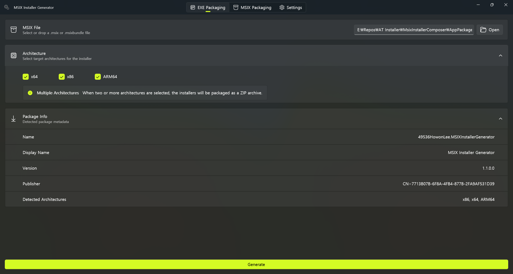

# MSIX Installer Generator

**[한국어](MSIX.ko.md)** | English

[](https://www.nuget.org/packages/aticmsixgen)
[](https://github.com/airtaxi/AT-Installer/actions/workflows/pack-and-publish.yml)

A tool for creating Windows sandboxed installers from any application.<br><br>


## Why MSIX?

MSIX is a Windows packaging format with benefits for both developers and end users:

- **Sandboxed by design**: Windows automatically manages the registry keys, file associations, and other system changes your program makes, all inside an isolated environment.
- **Clean uninstall**: when the user removes the application, nothing is left behind. No orphaned registry entries or leftover AppData folders.
- **Multi-architecture in one package**: the MSIXBundle format lets you ship x64, x86, and ARM64 builds inside a single `.msixbundle` file. Users download once and Windows installs the right architecture automatically.

But MSIX on its own is hard to distribute. End users must enable Developer Mode, run PowerShell commands, trust certificates, and deal with confusing dependency errors before they can even install.

AT Installer and MSIX Installer Generator handle this. You get the sandboxing, clean uninstalls, and multi-architecture packaging of MSIX, combined with the simplicity of a double-click EXE installer.

## Getting Started

### Download from the Microsoft Store

[](https://apps.microsoft.com/detail/9P5GS17TCDQX)

### Prerequisites

- Windows 10 (1809) or later

---

## MSIX Packaging

When your application framework (e.g. Electron, Tauri, WPF) does not provide native MSIX packaging, MSIX Installer Generator makes it easy. The tool uses the [WinApp CLI](https://github.com/microsoft/WinAppCli) to handle MSIX packaging, so you don't have to.

> Already have a packaged MSIX application? Jump straight to the [EXE Packaging](#exe-packaging) section.

MSIX packaging is divided into three steps: **Certificate**, **Manifest**, and **Packaging**.

### Certificate

A certificate is not strictly required for distribution, but it is **strongly recommended**. MSIX requires users to trust the certificate before sideloading, so if you sign every release with a temporary certificate, users end up adding a new certificate to their system on every update.

To avoid this, generate a dedicated certificate once and reuse it across releases.

Three inputs are needed:

- **Publisher**: This is an X.500 distinguished name field. If you're unfamiliar with X.500, just enter your publisher name and it will be automatically mapped to the X.500 Common Name (CN). Use the name of the entity distributing the application.
- **Validity (days)**: Once the validity period expires, you can no longer create new signatures with this certificate. However, signatures made while the certificate was valid remain valid even after expiry, so choose an appropriate period. The default is **5 years (1825 days)**.
- **Password**: The default is `password`. This password is required when generating an MSIX package, and the packaging menu auto-fills the default password for you. If you want stronger security, you can set a more robust password.

### Manifest

A manifest (`.aticmsixconfig`) consolidates all the information MSIX needs (except version and certificate) into a single settings file. Create the manifest before packaging to define your application's basic metadata:

| Field | Description |
|---|---|
| **Display Name** | The application's display name shown to users. |
| **Description** | A human-readable description of the application. |
| **Executable** | The executable file name inside the build output (e.g. `MyApp.exe`). Used to detect the architecture of each folder. |
| **Logo** | (Optional) Path to a logo image (`.png`, `.jpg`, `.bmp`, `.ico`). Embedded directly in the manifest. |

### Packaging

With a manifest, certificate, version, and one or more build output directories, you're ready to package.

Because MSIX supports the **MSIXBundle** format, which lets multiple architectures live in a single package, you can add a separate output folder for each architecture (e.g. one for x64, one for ARM64). The tool detects each folder's architecture automatically from the executable and produces a single `.msix` (one architecture) or `.msixbundle` (multiple architectures).

---

## EXE Packaging

> The EXE Packaging menu takes a pre-packaged MSIX or an MSIX produced by MSIX Installer Generator and turns it into a standalone installer EXE.

MSIX alone is not a good distribution format for end users. As noted in the [README](README.md), sideloading an MSIX requires enabling Developer Mode, running PowerShell commands, and trusting certificates, which average users should not have to deal with.

**EXE Packaging automates the sideloading process.** The output is a single self-extracting EXE installer (per architecture) or a single ZIP archive containing per-architecture installers. Users download and run it like any Windows installer, without PowerShell, Developer Mode, or certificate prompts.

---

## MSIX Installer Generator CLI

For AI-assisted workflows or CI automation, the **MSIX Installer Generator CLI** (`aticmsixgen`) provides every feature of the GUI tool from the command line. It is a NativeAOT single executable with no runtime dependencies.

### Installation

Install as a [.NET global tool](https://learn.microsoft.com/dotnet/core/tools/global-tools) from NuGet:

```
dotnet tool install --global aticmsixgen
```

Update to the latest version:

```
dotnet tool update --global aticmsixgen
```

Uninstall:

```
dotnet tool uninstall --global aticmsixgen
```

### Commands

| Command | Summary |
|---|---|
| `cert generate` | Generate a self-signed PFX certificate. |
| `manifest create` | Create a new `.aticmsixconfig` manifest file. |
| `manifest show <path>` | Display manifest config file contents. |
| `manifest update <path>` | Update an existing `.aticmsixconfig` manifest file. |
| `msix-pack` | Package MSIX/MSIXBundle from a manifest config file and output folders. |
| `msix-quick-pack` | Package MSIX/MSIXBundle from inline parameters without a manifest file. |
| `exe-pack` | Create SFX EXE installer(s) from an existing MSIX/MSIXBundle. |

### Examples

Generate a self-signed certificate:

```
aticmsixgen cert generate --publisher "My Company" --output cert.pfx
```

Create a manifest:

```
aticmsixgen manifest create --display-name "My App" --description "A great app" --executable "MyApp.exe" -o app.aticmsixconfig
```

Display an existing manifest:

```
aticmsixgen manifest show app.aticmsixconfig
```

Update a manifest (e.g. change the display name):

```
aticmsixgen manifest update app.aticmsixconfig --display-name "My App v2"
```

Package an MSIXBundle from a manifest with multiple architectures:

```
aticmsixgen msix-pack --manifest app.aticmsixconfig -o MyPackage.msixbundle -f bin\x64\Release -f bin\arm64\Release --cert cert.pfx --version 1.0.0.0
```

Quick-pack without a manifest file (inline parameters):

```
aticmsixgen msix-quick-pack --display-name "My App" --description "A great app" --executable "MyApp.exe" -o MyPackage.msix -f bin\x64\Release --cert cert.pfx --version 1.0.0.0
```

Compose a standalone EXE installer from an MSIXBundle:

```
aticmsixgen exe-pack -i MyPackage.msixbundle -o MyInstaller.zip
```

> Run `aticmsixgen --help` for the complete list of options.

## Author

**Howon Lee (airtaxi)**

- GitHub: [@airtaxi](https://github.com/airtaxi)

## Contributing

Contributions are welcome! Please feel free to submit a Pull Request.